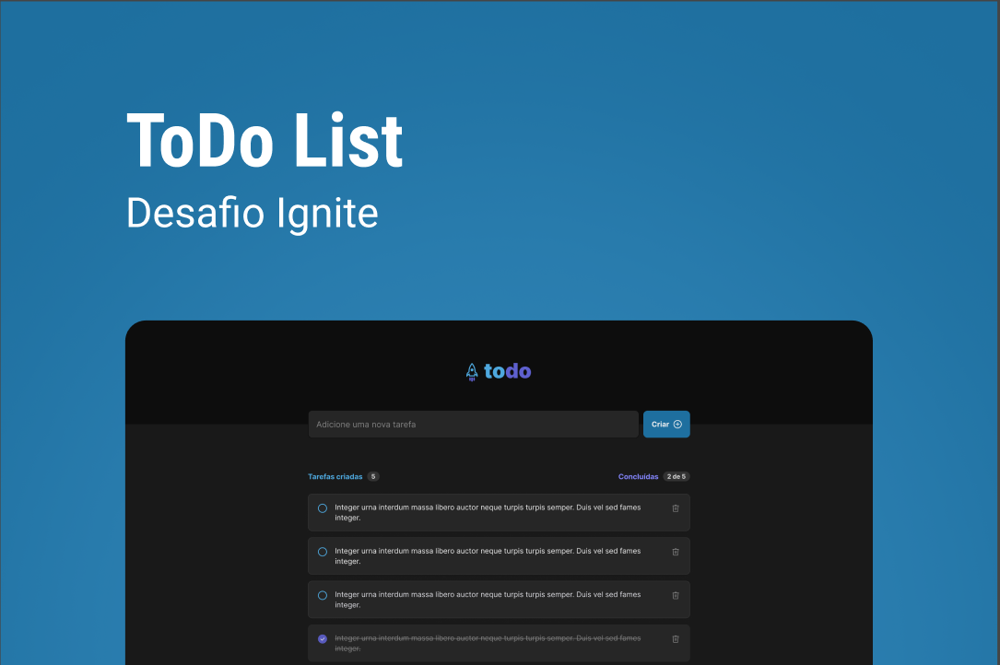

<h3 align="center">
  Desafio 01 - Conceitos do React
</h3>

<p align="center">
  <a href="https://rocketseat.com.br">
    
  </a>
  
  <a href="https://www.linkedin.com/in/luís-henrique-machado-98037a127/">
    
  </a>
</p>

<br>

## :rocket: Sobre o desafio

<p align="center">
  
</p>

Nesse desafio, você vai desenvolver uma aplicação de controle de tarefas no estilo **to-do list**, que contém as seguintes funcionalidades:

- Adicionar uma nova tarefa
- Marcar e desmarcar uma tarefa como concluída
- Remover uma tarefa da listagem
- Mostrar o progresso de conclusão das tarefas

layout da aplicação: https://www.figma.com/file/0n0zDN7zbzhRbaEO74Xesx/ToDo-List/duplicate
<br>

## :wrench: Instalação e uso

```bash
# Abra um terminal e copie este repositório com o comando
git clone https://github.com/lhfam97Desafio-01---Praticando-os-conceitos-do-ReactJS
# ou use a opção de download.

# Instale as dependências
yarn install

# Rode a aplicação
yarn dev

# Acesse http://localhost:3000 no seu navegador
```

<br>

## :memo: Licença

Esse projeto está sob a licença MIT. Veja o arquivo [LICENSE](/LICENSE) para mais detalhes.

---

Feito com :purple_heart: by [Luís Machado](https://github.com/lhfam97)

[](https://www.linkedin.com/in/luís-henrique-machado-98037a127/) 
[](mailto:lhfam97@gmail.com)
